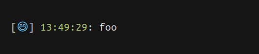

# oh-my-log [![version][npm-version]][npm-url] [![License][npm-license]][license-url]

> Beautiful console logs for your console applications with [native string substitution](https://nodejs.org/docs/latest/api/console.html#console_console_log_data)

[![Build Status][travis-image]][travis-url]
[![Downloads][npm-downloads]][npm-url]
[![Code Climate][codeclimate-quality]][codeclimate-url]
[![Coverage Status][codeclimate-coverage]][codeclimate-url]
[![Dependencies][david-image]][david-url]

## Install

```sh
npm install --save oh-my-log
```

## Usage

### myLog(name, [options])

- **name** (`String`, *Required*): The name/label to use
- **options** (`Object`, *Optional*): An optional [`options`](#options) object may be passed that alters certain behaviours

Returns: `Function` The logging function


```js
var myLog = require('oh-my-log')

var log = myLog('😄', {
  styles: {
    name: 'blue',
    date: 'green'
  }
})


log('foo')
```

The above example will output:



### Options

| Name      | Type       | Required | Description                                                                                                        | Default          |
| --------- | ---------- | -------- | ------------------------------------------------------------------------------------------------------------------ | ---------------- |
| `locals`  | `Object`   | no       | `locals` object, used to substitute `prefix` values using [`fürmat`](https://github.com/ahmadnassri/furmat)        | `false`          |
| `prefix`  | `String`   | no       | prefix this string after substitution with `locals` values using [`fürmat`](https://github.com/ahmadnassri/furmat) | `[%name] %date:` |
| `date`    | `Object`   | no       | [date options](#date-options) object                                                                               |                  |
| `styles`  | `Object`   | no       | [style options](#style-options) object                                                                             |                  |
| `func`    | `Function` | no       | The logging function                                                                                               | `console.log`    |

#### Date Options

| Name      | Type     | Required | Description                                                                   | Default       |
| --------- | -------- | -------- | ----------------------------------------------------------------------------- | ------------- |
| `format`  | `String` | no       | any [`dateformat`](https://www.npmjs.com/package/dateformat) compatible value | `hh:MM:ss TT` |

#### Style Options

| Name   | Type           | Required | Description                                                                                 | Default            |
| ------ | -------------- | -------- | ------------------------------------------------------------------------------------------- | ------------------ |
| `name` | `String|Array` | no       | any [`chalk`](https://www.npmjs.com/package/chalk#styles) *style* value, or array of values | `['blue', 'bold']` |
| `date` | `String|Array` | no       | any [`chalk`](https://www.npmjs.com/package/chalk#styles) *style* value, or array of values | `['green']`        |

`oh-my-log` will also look for `options` object in your `package.json` file. *This is accomplished using [`pkg-config`](https://www.npmjs.com/package/pkg-config), refer to `pkg-config`'s [README](https://github.com/ahmadnassri/pkg-config/blob/master/README.md) for more info*

## License

[ISC License](LICENSE) &copy; [Ahmad Nassri](https://www.ahmadnassri.com/)

[license-url]: https://github.com/ahmadnassri/oh-my-log/blob/master/LICENSE

[travis-url]: https://travis-ci.org/ahmadnassri/oh-my-log
[travis-image]: https://img.shields.io/travis/ahmadnassri/oh-my-log.svg?style=flat-square

[npm-url]: https://www.npmjs.com/package/oh-my-log
[npm-license]: https://img.shields.io/npm/l/oh-my-log.svg?style=flat-square
[npm-version]: https://img.shields.io/npm/v/oh-my-log.svg?style=flat-square
[npm-downloads]: https://img.shields.io/npm/dm/oh-my-log.svg?style=flat-square

[codeclimate-url]: https://codeclimate.com/github/ahmadnassri/oh-my-log
[codeclimate-quality]: https://img.shields.io/codeclimate/github/ahmadnassri/oh-my-log.svg?style=flat-square
[codeclimate-coverage]: https://img.shields.io/codeclimate/coverage/github/ahmadnassri/oh-my-log.svg?style=flat-square

[david-url]: https://david-dm.org/ahmadnassri/oh-my-log
[david-image]: https://img.shields.io/david/ahmadnassri/oh-my-log.svg?style=flat-square
